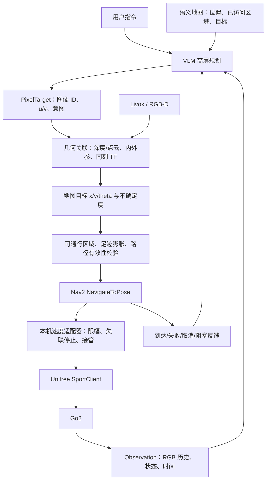

# 从基础控制到像素目标导航

## 目标与当前边界

实现图中的闭环：任务指令、RGB 历史和语义地图输入 VLM；VLM 选择可走地面上的像素目标；几何模块查询真实距离并转换为 `(x,y,theta)`；Nav2 规划执行；新观测及执行结果反馈给 VLM。

图中的“Explore 17th floor”是示例任务，不是系统默认任务。
当前已实测 RGB、状态与一次前进/停止；没有完成 RGB–LiDAR 标定、导航定位或 Nav2 避障验收。VLM/GPT 在当前 Codex 对话中选择动作，通过本机 CLI 调用控制，不需要再套一层模型 API。后续无人值守服务可替换这个调用方，但不能替换本地执行约束。

`step` 是第一阶段独立的短时运动原语，**不能作为任意 Nav2 路径或连续 cmd_vel 的直接替代**。

## 模块组织

| 目录/模块 | 责任与接口 | 状态 |
|---|---|---|
| `control/go2.py` + `control/cpp/` | observe/state/step/stop；干净 SDK 进程、审计日志、受限执行 | 本轮实现 |
| `control/captures/step_verification/` | 首次真实移动的图像、状态和停止证据 | 已保留，来自旧执行器 |
| `mapping/` | 复用现有 Livox 驱动、里程计/建图/定位及 Nav2 工程 | 源码存在，需逐项验收 |
| `perception/` | 同步 RGB、点云、相机模型与外参，生成 Observation | 后续建设，不创建空节点 |
| `grounding/` | PixelTarget → 相机射线/3D 点 → map 目标，输出协方差/拒绝原因 | 后续建设 |
| `navigation/` | Nav2 action 客户端、目标校验、cmd_vel 适配、取消与结果反馈 | 后续建设 |
| `planner/` | 指令、历史、语义地图 → 像素候选；有限次重规划 | 后续建设 |
| `planner/model-deployment-test/` | NaVILA 真机实验执行器：SSH 隧道、multipart 推理、离散动作与本地控制入口 | 实验模块，需按真机验收逐步放行 |
| `skills/elf-go2-control/` | 供 Codex 调用基础能力的工作流程 | 本轮实现 |

基础模块仅依赖官方 C++ SDK、CMake、Python 3.8+、Pillow；不导入 ROS Python、旧 navila 包或 ROS 的 DDS 动态库。源码参考旧桥接中的独立相机/状态客户端、限时动作、停止和干净环境启动方法。现阶段无需把 TCP 服务全搬入：模型就在 NX 上操作本机 CLI；以后远程模型由独立网关接入同一执行层。

## 数据契约

详细字段见 [navigation-contracts.md](navigation-contracts.md)。必须保持：

1. **Observation 身份**：UUID、原图尺寸、路径/哈希、采集时间与时钟域。当前 SDK JPEG 没有曝光时间，`sensor_stamp=null`；不能把 RPC 收到时间冒充传感器同步时间。
2. **像素约定**：原图左上为 `(0,0)`，u 向右、v 向下。VLM 如果看的是缩放/裁剪图，先用明确记录的变换还原到原始图，不能用显示尺寸直接查深度。
3. **深度定义**：声明米制的光轴 Z 或沿射线距离。去畸变、内参和深度对齐必须一致。针孔且 Z-depth 时：`X=(u-cx)*Z/fx, Y=(v-cy)*Z/fy`；沿射线距离须使用归一化射线。Go2 广角图像需先用对应镜头模型处理。
4. **空间变换**：`camera_optical` 是右/下/前；`base_link` 是前/左/上。通过标定外参和观测时刻的 TF 变换，不手写轴交换或丢掉相机高度。
5. **雷达深度**：点云稀疏、有遮挡且扫描有时间跨度。投影需内外参、时间同步/运动补偿和遮挡筛选；目标像素无可靠点时拒绝或重新选点，不能随便取最近像素的距离。没有必要为了一个目标生成整幅稠密深度图。
6. **目标可走**：选地面落脚区域；对“走到门/桌子”生成前方停靠位置，不能把物体表面点直接当机器人中心。Nav2 costmap 结合足迹、净空、地面/台阶/负障碍检查。二维地图不证明楼梯可走。
7. **朝向**：深度只给一个空间点；theta 应按到达朝向策略计算（如朝向目标/门），不是由单个像素自动获得。
8. **定位**：SportState.position 只是机器人估计，不能直接宣称为 ROS map 坐标或完整 /odom。需确认原点、漂移、速度坐标系、TF 唯一发布者及融合策略。

## 控制层级与部署

- 任务/语义：VLM 低频选短程目标，模型时延不进入速度保持回路。
- 导航：Nav2 处理路径、局部控制和反馈；部署频率根据硬件实测。
- 本机适配：持续读取状态、遥控器与传感器新鲜度，执行速度上限和 watchdog；任何上游失联进入停止。
- 底层：Go2 自带运动服务处理步态与平衡。仅 `SportClient.Move/StopMove`；不关闭 sport_mode、不接 LowCmd、不自动站起。
- 首次确认拓扑：NX eth0 `192.168.123.18/24` 接内部 DDS，wlan0 负责外网。domain 0。`GO2-NX` 是 NX 自己的热点配置，不能由此推断 Go2 内部网段。
- ROS 2 通常把 DDS 的 `rt/sportmodestate` 映射为 `/sportmodestate`。互通要同时匹配 domain、消息类型、QoS 和发现网络；仅 `ros2 topic list` 空不能证明硬件或服务不存在。

## 状态机和技能分工

执行循环：`OBSERVE → SELECT → GROUND → VALIDATE → EXECUTE → VERIFY → OBSERVE`。
深度缺失/TF 不可用/过期：回到 OBSERVE 或返回失败；取消、传感器失联、运动异常：STOP 并报告。Nav2 目标设超时与取消；禁止不断重复发送失败动作。仅在用户任务仍有效、数据新鲜且本地状态允许时继续。

| Skill | 职责 | 本次交付 |
|---|---|---|
| `elf-go2-control` | 观察、人工语义判断后短步、停止、核验；基础动作唯一入口 | 可发现的 SKILL.md 和命令 |
| `elf-pixel-goal` | 选择地面像素、坐标还原、请求几何模块；不发速度 | 设计名称/职责，待几何接口可用再建 |
| `elf-nav2-navigation` | 发送/监控/取消 NavigateToPose，检查 TF 与 costmap | 设计名称/职责，待实机验收再建 |
| `elf-semantic-exploration` | 任务分解、已访问/未访问区域、语义记忆、有限重规划 | 设计名称/职责，最后建设 |

不要把所有技能都自动触发为“允许移动”。研究、改代码、制作框图只涉及文件操作；真实动作授权由当前用户任务决定。未来技能调用基础运动层，而非各自复制 SportClient 或另起竞争控制器。

## 分阶段验收

### P0 — 当前基础能力

独立构建；实时 RGB/state；step 默认 dry-run；明确 --execute 才调用 SDK；状态过期、非零错误码、姿态异常停止；每次留日志。旧执行器已完成一次约 31 cm 前进。新执行器更严格，离线和只读验收后仍需单独的实机运动验收，不能继承旧二进制的认证。

### P1 — 深度与坐标

确认真实 Livox 型号、点云/IMU topic、时间戳、CameraInfo/鱼眼模型与外参；静态/移动各采样。用已测距离的地面标靶检查像素反投影误差和无效点拒绝。输出带 frame、时间与误差的 map goal；此阶段只在 RViz 标记，不移动。

### P2 — Nav2 独立导航

先手工指定近距离 map 目标，确认 map→odom→base_link→sensors 的 TF、定位、地面过滤、足迹与 costmap。新增连续 cmd_vel adapter（不能循环调用 step），建立超时停止、遥控优先和单控制器仲裁。实测到达、障碍、取消、传感器丢失、远端中断；运动中 error_code=2 的解释需先获得官方/固件对应依据。

### P3 — VLM 像素闭环

连通 Observation/PixelTarget/NavigationGoal，先记录候选目标和拒绝原因；再验证受限短程任务。测试图像缩放、旧帧、目标遮挡、深度空洞、定位跳变、模型超时、Nav2 失败。不把模型 confidence 当作物理安全概率。

### P4 — 语义探索

加入地图版本、房间/物体关联、覆盖度和重复访问避免；用户指定区域/禁入区域/最大距离和时间；评估完整任务成功率与停机行为。最后才考虑无人值守持续探索。
